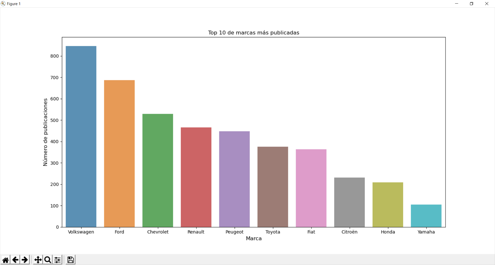
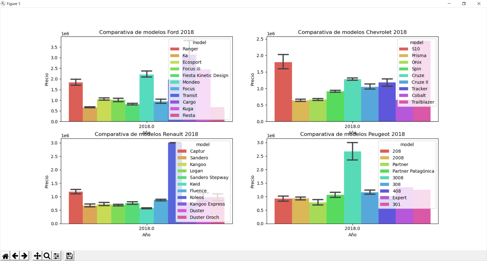
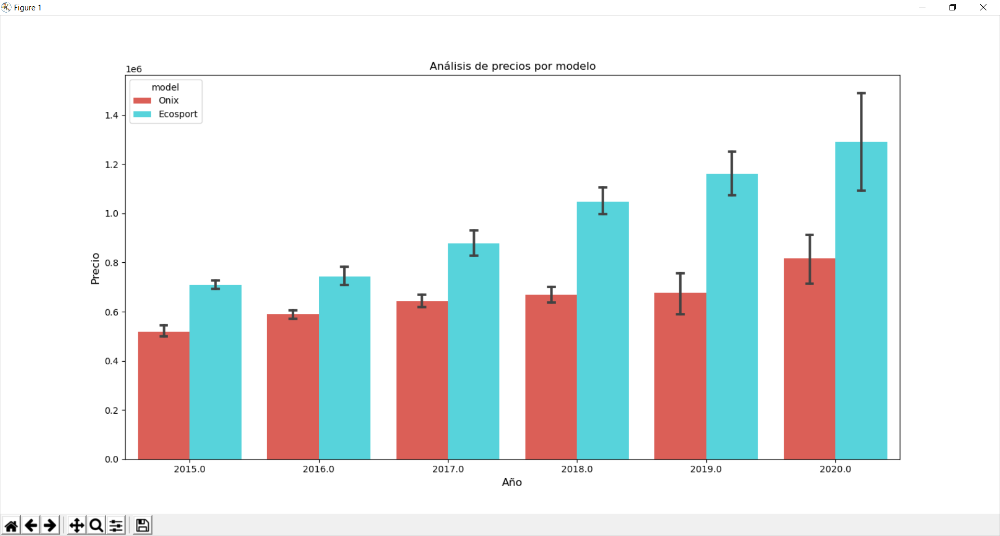

# Data Mercado Autos

This is a set of tools to analize used car market information obtained from Mercado Libre.

## Getting started

### Installation

Clone this repository and install the requirements:

```
$ git clone https://github.com/nahueespinosa/data-mercado-autos.git
$ pip3 install -r requirements.txt
```

### Usage

You'll find two python programs:

- `loader.py`: contains the `DataLoader` class to download data using Mercado Libre's API.
- `analize.py`: contains the `DataAnalizer` class that can display information in useful plots.

Note that to download more than 1000 items from Mercado Libre you'll need to provide an `access_token`. See [here](https://developers.mercadolibre.com.ar/es_ar/autenticacion-y-autorizacion).

```
CLIENT_ID = 'YOUR_CLIENT_ID'
CLIENT_SECRET = 'YOUR_CLIENT_SECRET'
```

You can find more information using the help argument:

```
$ python analize.py -h
usage: analyze.py [-h] FILE

Analize used car market information from FILE.

positional arguments:
  FILE        Data file path.

optional arguments:
  -h, --help  show this help message and exit
```

### Examples

Here are some plot examples.

```python
analizer.graph_top_brands()
```



```python
analizer.graph_brand_prices(['Ford', 'Chevrolet', 'Renault', 'Peugeot'], 2018)
```



```python
analizer.graph_model_prices(['Ecosport', 'Onix'])
```

